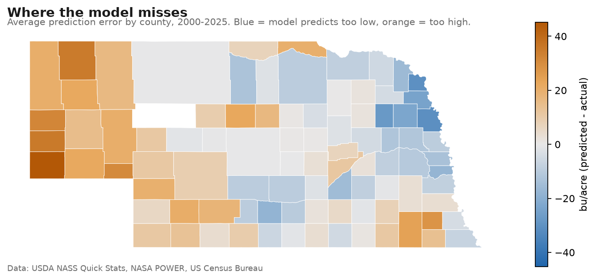

# Corn Yield Predictor — Nebraska, Tested On Iowa

County-level corn yield prediction from weather, soils and irrigation, built to answer a
question most yield models skip: **does the model generalize, or has it memorized one state?**

A Nebraska-trained model, applied cold to Iowa counties it had never seen, reached
**R² 0.51** against a floor of −0.26 and an Iowa-native ceiling of 0.70 — and closed 70% of the
14 bu/acre level gap between the two states from its inputs alone. Along the way the temporal
holdout caught something better than a good score: a set of relationships that were true in
Iowa until 2018 and **stopped being true afterwards**.

Built as a portfolio project during my M.S. in Data Science. Python · scikit-learn ·
GeoPandas · PySAL · Altair · Streamlit.

## Why This Project

Nebraska is one of the top corn-producing states and among the most heavily irrigated in the
U.S. USDA NASS reports county yields separately for irrigated and non-irrigated corn, and
rainfall drops sharply from east to west across the state. That makes it a natural experiment
in how much weather matters when irrigation isn't there to buffer it.

Iowa is the control: it borders Nebraska, grows more corn than any other state, and differs
in the ways that matter — better and far more uniform soils, more reliable rainfall, and
essentially no irrigation.

## Headline Results

### 1. How You Validate Changes The Answer

Every model is scored three ways, because the three answers differ and only two of them are
honest. Random cross-validation leaks: neighbouring counties in the same year are near
duplicates. Holding out whole agricultural districts, or whole years, is the real test.

| Model | Random 5-fold | Leave-district-out | Train ≤2018 / test ≥2019 |
|---|---|---|---|
| Mean yield (dummy) | −0.00 | −0.06 | −0.60 |
| Ridge (trend + weather) | 0.405 | 0.249 | 0.201 |
| Gradient boosting | 0.565 | 0.395 | **−0.419** |
| Detrended boosting | 0.537 | 0.313 | −0.052 |

Random cross-validation inflates the spatial score by about 40%. And the model that wins
under both random and spatial splits is the one that fails worst on future years — because
**tree models cannot extrapolate**. Trained through 2018, gradient boosting scored worse than
guessing the average, since it can't produce a yield outside the range it has seen. Fitting a
linear trend first and modelling the residual (`DetrendedRegressor`) fixed it.

### 2. Domain Knowledge Beat Model Tuning

Each row adds one feature to the row above — same model, same folds, same rows:

| Feature set | Spatial RMSE | Spatial R² | Temporal R² |
|---|---|---|---|
| Weather only (all 2,069 rows — control) | 26.53 | 0.313 | −0.052 |
| Weather only (2,002 study rows) | 24.51 | 0.395 | −0.019 |
| + irrigation share | 19.90 | **0.601** | 0.294 |
| + NCCPI soil rating | 19.35 | 0.623 | 0.471 |
| + elevation | 19.06 | 0.634 | 0.497 |
| + corn-soybean rotation | 18.91 | 0.640 | 0.490 |
| + spring / planting-window weather | 18.52 | 0.655 | 0.473 |
| All features, no look-ahead control | 17.83 | **0.680** | **0.542** |

Irrigation share — reconstructed from NASS harvested-acre ratios, since it isn't published as
a feature — lifted the spatial score by **+0.27 R²**, more than any amount of hyperparameter
tuning. It came from knowing what Nebraska farming looks like, not from the model.

The last row is a leakage control: the irrigation series is rebuilt using only observations
from 2018 or earlier, so the temporal test can't borrow from the 2022 Census. The score
didn't fall, so the leak wasn't doing any work.

**The first two rows are the same features on different rows.** Sixty-seven county-years drop
out for want of an optional feature, and that alone moves spatial R² by **+0.082** — larger than
most features in this project. The row set is a variable, so the ladder reports it and scores
the baseline twice.

Ablation tells a different story from the ladder, which is why both are reported. Removing
irrigation share costs **0.32** of spatial R². Removing the soil rating *improves* both scores
(spatial 0.655 → 0.675, temporal 0.473 → 0.508): in Nebraska NCCPI is not merely redundant but
harmful, across four independent runs. A ladder measures what a feature adds to what came
before; ablation measures what is lost when nothing can substitute for it — and only the second
one can tell you to delete something.

### 3. The Two States Need Different Models

Iowa's best spatial score is **0.781** — the highest in the project — and the feature that
got it there is one Nebraska barely notices.

| Iowa, cumulative | rows | spatial R² | temporal R² |
|---|---|---|---|
| Weather only (control / study rows) | 2,470 / 2,444 | 0.701 / 0.694 | 0.147 / 0.161 |
| + NCCPI soil rating | 2,444 | 0.677 | 0.336 |
| + elevation | 2,444 | 0.654 | 0.357 |
| **+ corn-soybean rotation** | 2,444 | **0.769** | **0.480** |
| + spring / planting-window weather | 2,444 | **0.781** | 0.342 |

Corn following soybeans out-yields corn following corn by roughly 10–15%, and a county's
acreage split says how much of its corn is rotated. Reconstructed from NASS planted acres —
not published as a feature — it's worth **+0.115 spatial** in Iowa and **+0.006** in Nebraska.

The asymmetry has a cause: in Nebraska `corn_share` correlates +0.64 with irrigation share
and −0.81 with soil rating, so it restates columns already in the model. Iowa's continuous
corn is a genuinely separate fact about a county.

Ablation turns that into two different recommendations, each with a table behind it:

- **Nebraska: drop NCCPI.** Removing it improves spatial 0.655 → 0.675 *and* temporal 0.473 → 0.508.
- **Iowa: the spring features are a trade.** With them, 0.781 spatial and 0.342 temporal;
  without, 0.769 and **0.480**. Keep them to rank unseen counties, drop them to forecast.

One model per region, chosen by evidence rather than by preference.

### 4. The Errors Are A Map, Not Noise



Moran's I on the pooled county errors is **+0.599 (p = 0.001)** — strongly clustered, and
significantly clustered in all 26 years individually, in both states. Random error looks like
static; this looks like a map of something real: overprediction in the sandy, high-elevation
west, underprediction in the loess-soil northeast. That map is what motivated adding soil
productivity and elevation.

Worth stating plainly: **no feature added so far has fixed it.** Moran's I went 0.615 → 0.599
when spring weather went in, while R² moved a long way. Those measure different things — R²
asks how big the errors are, Moran's I asks whether they're arranged in a pattern — and the
remaining pattern is what cropland-weighted weather is meant to address.


The irrigation feature, recovered from acreage ratios alone, reproduces Nebraska's real
agricultural geography: heavy irrigation up the central Platte Valley and west, near zero in
the wetter southeast. A feature that reproduces a geography you already know is probably
measuring what you think it is.

### 5. Does It Transfer? Iowa Says Mostly Yes

`scripts/cross_state.py --train NE --test IA` trains on Nebraska only and predicts Iowa cold —
without irrigation share, because Iowa doesn't irrigate.

| | RMSE | MAE | R² | bias |
|---|---|---|---|---|
| Iowa's own model (leave-district-out) — *the ceiling* | 15.28 | 11.65 | **0.70** | −0.41 |
| Nebraska's average yield applied to Iowa — *the floor* | 31.22 | 25.62 | **−0.26** | −14.14 |
| Trained on Nebraska, applied cold | 19.43 | 15.44 | **0.51** | −4.35 |
| …same predictions, average offset removed | 18.94 | 14.51 | 0.54 | 0.00 |

- The transfer lands **80% of the way from floor to ceiling** on a state it has never seen,
  and retains **80% of Iowa's own within-year county-ranking skill**.
- **Bias fell from −14.1 to −4.4**: the model recovered ~70% of the level difference between
  the states from its inputs, rather than memorizing Nebraska's average.
- **Cold and offset-corrected scores are nearly identical**, which says the residual error is
  *pattern* error, not a calibration offset — the harder kind, and the honest one to report.

Where it breaks is as informative as where it works. Scoring the transfer by how well it ranks
counties *within* each year, two years failed outright — and adding the spring features split
them apart:

| Year | Before | After | Cause |
|---|---|---|---|
| **2013** | −0.315 | **−0.141** | Record-wet, late-planted spring |
| **2020** | −0.062 | −0.116 | The August 10 derecho |

2013 improved by more than half, because the model can now see the spring. 2020 got slightly
worse, because there is still **no wind variable** and extra features only give a model more
ways to be confidently wrong about a cause it cannot see. A change that fixes the case you
predicted and leaves the case you didn't is better evidence than one that improves everything.

### 6. A Relationship That Expired

The temporal holdout caught something a spatial split never could. Spring features improved
Nebraska on every test, but in Iowa they *repaired* the spatial score and *wrecked* the temporal
one. Correlating each feature with yield anomaly on either side of the training cutoff:

| Iowa feature | ≤2018 | ≥2019 |
|---|---|---|
| `precip_apr_may_mm` | −0.189 | +0.031 |
| `gdd_may` | −0.262 | −0.002 |
| `last_frost_doy` | +0.200 | −0.145 |

Every spring relationship weakened, vanished or flipped sign. Iowa's three worst planting
springs tell the story: 2013 yielded **17 bu/acre below trend**, while 2019 and 2024 — the next
two worst — came in **above** it. The model learned 2013's lesson and misapplies it.

This is **non-stationarity**, and it is the kind of thing that breaks deployed models silently.
The decision taken here was to keep the features and report the drift rather than quietly drop
them to protect a number.

### 7. The Same Feature Can Mean Opposite Things

| Feature | Nebraska | Iowa |
|---|---|---|
| `precip_mm` | **+0.313** | **+0.036** |
| `dry_spell_max` | **−0.108** | **+0.195** |
| `workable_days` (vs yield anomaly) | **−0.10** | **+0.12** |

In Nebraska a long dry spell is a drought, and a dry workable spring leaves an empty soil
profile heading into July. In Iowa, where rain is rarely the binding constraint, a dry spell
means sunshine and fields that aren't waterlogged, and a dry spring just means the planter kept
moving. Same columns, same units, same code, opposite signs. A model fitted on pooled Corn Belt
data would average these into nothing.

## What I'd Fix Next

Honest limitations, in the order they'd matter:

1. **One weather point per county.** Large western counties mix cropland and rangeland; the
   fix is weighting weather by the USDA Cropland Data Layer.
2. **No wind.** The 2020 derecho is the clearest single failure in the project, and the one
   remaining case where the information was never in the feature set at all.
3. **Iowa's spring relationships have drifted.** They hold through 2018 and not afterwards, so
   an Iowa model should be refit on recent years or weight them more heavily.
4. **Nebraska 2019 is still the second-largest miss.** That disaster was ice, not water — rain
   on frozen ground, ice jams, failed levees — and a precipitation column cannot see any of
   that.
4. **Coverage is not missing at random.** NASS reported 91 Nebraska counties in 2000 and 46
   in 2025, and the counties that stop reporting are the ones that grow little corn.

## Data Sources

| Source | Used for |
|---|---|
| [USDA NASS Quick Stats](https://quickstats.nass.usda.gov/) | County yields, acres by practice, corn/soybean planted acres |
| [NASA POWER](https://power.larc.nasa.gov/) | Daily growing-season weather |
| [USDA Soil Data Access](https://sdmdataaccess.sc.egov.usda.gov/) | NCCPI soil productivity, available water capacity |
| [USGS EPQS](https://apps.nationalmap.gov/epqs/) | County elevation |
| [Census TIGER / Gazetteer](https://www.census.gov/geographies/mapping-files/time-series/geo/tiger-line-file.html) | County boundaries and centroids |
| USDA Cropland Data Layer | Planned: cropland-weighted weather |

## Project Structure

```
app/                  Streamlit app (multipage)
src/yieldpred/        Core logic
  nass.py             USDA NASS Quick Stats client and cleaning
  weather.py          NASA POWER download and growing-season features
  irrigation.py       Irrigated share of corn acres from NASS acreage
  rotation.py         Corn-soybean rotation intensity from NASS planted acres
  soils.py            NCCPI and available water from USDA Soil Data Access
  terrain.py          County elevation from USGS
  dataset.py          Joins everything into the county-year modeling table
  trend.py            DetrendedRegressor - the trend/deviation split
  spatial.py          Contiguity weights and Moran's I
  geo.py              County boundaries, topology-safe simplification
  viz.py              Static and interactive choropleths
  gridmet.py          gridMET at 4 km - the measured alternative to POWER's 55 km
  leak.py             Leak-free spatial CV, and the control that makes it readable
  theme.py            Sky & Soil - the one place colour is defined
  disclaimer.py       Legal notices, one source for the app and this README
  appdata.py          Streamlit-free data access for the app
scripts/              Runnable steps, all --state aware
  fetch_*.py          Downloads (NASS, POWER, gridMET, soils, terrain, rotation)
  train_baseline.py   Models, validation, feature ladder, ablation, controls
  analyze_errors.py   Moran's I and error maps
  cross_state.py      Train on one state, predict another
  probe_weather_grid.py  Is one weather point per county good enough? (no downloads)
  check_network.py    Which of the five data sources can this machine reach?
notebooks/            Exploration
data/raw/             Raw downloads and API cache (not committed)
data/processed/       Small cleaned files used by the app
figures/              Generated maps
tests/                Unit tests (no network or API key needed)
```

## Getting Started

```bash
python -m venv .venv          # Python 3.12
.venv\Scripts\activate        # Windows (macOS/Linux: source .venv/bin/activate)
pip install -r requirements-dev.txt   # full pipeline (requirements.txt is app-only)

copy .env.example .env        # then paste your NASS API key into .env
python scripts/fetch_nass_yields.py    # county yields
python scripts/explore_coverage.py     # what the data covers
python scripts/fetch_weather.py        # ~4 min, cached afterwards
python scripts/fetch_irrigation.py     # irrigation share
python scripts/fetch_soil_terrain.py   # NCCPI + elevation
python scripts/train_baseline.py       # models, validation, feature study
python scripts/analyze_errors.py       # spatial diagnostics + maps
streamlit run app/streamlit_app.py
```

Any script runs for another state by passing `--state IA --state-fips 19`. The transfer test
is `python scripts/cross_state.py --train NE --test IA`.

Run the tests with `pytest` — they use synthetic fixtures, so no network or API key is needed.

## Roadmap

- [x] NASS county yields and coverage analysis
- [x] Growing-season weather features
- [x] Baseline models with spatial and temporal validation
- [x] Irrigation share as a feature, with a no-look-ahead control
- [x] Moran's I on model errors and error maps
- [x] NCCPI soil productivity and elevation
- [x] Interactive Streamlit app
- [x] Second state (Iowa) end to end
- [x] Cross-state transfer test
- [x] Spring / planting-window features, including a workable-fieldwork-days measure
- [x] Deployed to Streamlit Community Cloud
- [ ] Corn-soybean rotation features and the prevented-planting test
- [ ] Cropland-weighted weather (Cropland Data Layer)
- [ ] Wind and storm damage
- [ ] A third state, to turn one transfer result into a pattern

## Disclaimer

Educational and portfolio project. **Not agronomic, financial or insurance advice.**

Predictions are county averages with a typical error of roughly 14 bu/acre (Nebraska)
and 10 bu/acre (Iowa) on unseen counties, and the errors cluster geographically in
every year of the record. The model is retrospective and has never been validated for
in-season use. See the Limitations panel in the app, or `notes/METHODS.md`, for the
full accuracy picture.

This product uses the USDA NASS Quick Stats API but is not endorsed or certified by
USDA NASS. It likewise uses USDA NRCS Soil Data Access, NASA POWER, USGS and US Census
Bureau data without endorsement by those agencies. All source data is public; any error
in the analysis is mine.

## Author

Scott — add your LinkedIn / GitHub links here
