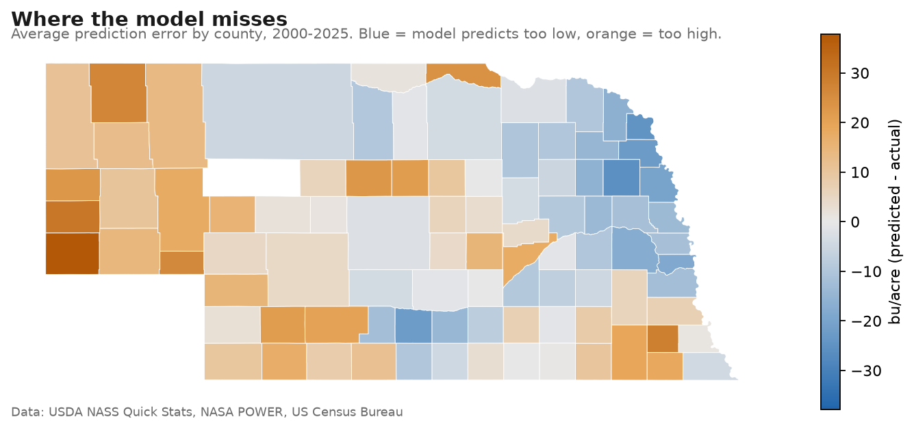
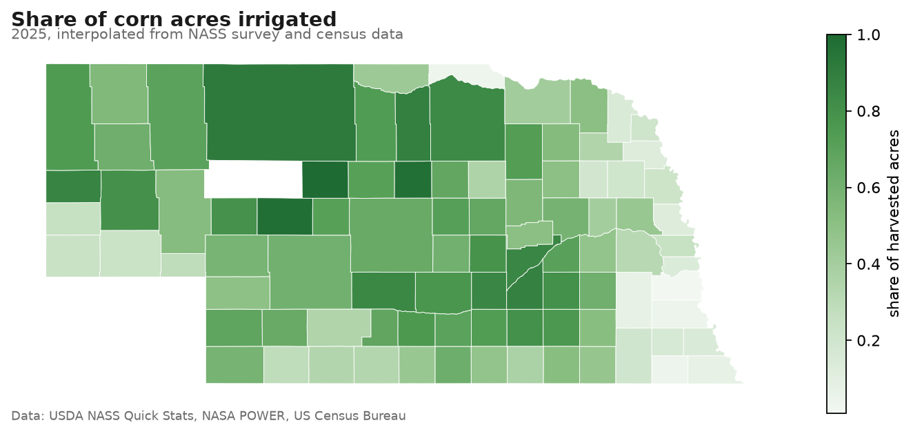

# Nebraska Corn Yield Predictor

Predicting county-level corn yields across Nebraska from weather, soils and cropland data, with a focus on how **irrigated and non-irrigated** fields respond differently to growing-season conditions.

> 🚧 Work in progress. Built as a portfolio project during my M.S. in Data Science.

## Why Nebraska?

Nebraska is one of the top corn-producing states and among the most heavily irrigated states in the U.S. USDA NASS reports county yields separately for irrigated and non-irrigated corn, and rainfall drops sharply from east to west across the state. Together, those make it a natural experiment in how much weather matters when irrigation isn't there to buffer it.

## Approach (Planned)

1. **Target:** county corn yields (bu/acre) from USDA NASS Quick Stats, 2000–present
2. **Features:** growing-season weather (PRISM / NASA POWER), soil productivity (gSSURGO), drought (US Drought Monitor), all summarized over cropland only using the USDA Cropland Data Layer
3. **Models:** baseline trend model → gradient boosting
4. **Spatial validation:** hold out whole regions (spatial cross-validation) instead of random rows
5. **Diagnostics:** maps of prediction error and Moran's I to check whether errors cluster geographically
6. **App:** interactive Streamlit map of predicted vs. actual yields

## Data Sources

| Source | Used for |
|---|---|
| [USDA NASS Quick Stats](https://quickstats.nass.usda.gov/) | County yields (target) |
| [USDA Cropland Data Layer](https://www.nass.usda.gov/Research_and_Science/Cropland/SARS1a.php) | Cropland mask |
| gSSURGO | Soil properties |
| PRISM / NASA POWER | Weather |
| US Drought Monitor | Drought severity |
| Census TIGER | County boundaries |

## What the Data Shows So Far

- **4,819 county-year yield records** across 91 counties, 2000–2025.
- **Irrigated vs. non-irrigated yields are reported only through 2018**, so the model
  targets all-practice yields and treats irrigation as a county characteristic.
- Over the 1,349 paired county-years, **irrigated corn out-yielded non-irrigated corn by
  84.5 bu/acre on average** — and the gap widens sharply in drought years (139.7 in 2012,
  119.7 in 2002, versus about 60 in wet years).

## Modeling Results

Every model is scored three ways, because the answers differ and only two of them are
honest. Random cross-validation leaks: neighbouring counties in the same year are near
duplicates. Holding out whole agricultural districts, or whole years, is the real test.

| Model | Random 5-fold | Leave-district-out | Train ≤2018 / test ≥2019 |
|---|---|---|---|
| Mean yield (dummy) | R² −0.00 | −0.06 | −0.60 |
| Ridge (trend + weather) | 0.40 | 0.25 | 0.20 |
| Gradient boosting | 0.57 | 0.40 | −0.42 |
| Detrended boosting | 0.54 | 0.31 | −0.05 |
| **+ irrigation share** | — | **0.58** | **0.35** |

Three things that took real work:

1. **Random cross-validation inflated the score by about 40%.** Reporting only the
   optimistic number would have overstated the model's accuracy on unseen counties.
2. **Tree models cannot extrapolate.** Trained through 2018, gradient boosting scored
   R² −0.42 on later years — worse than guessing the average — because it can't produce a
   yield outside the range it has seen. Fitting a linear trend first and modelling the
   residual (`DetrendedRegressor`) fixed it.
3. **Irrigation share was the single most valuable feature**, lifting the spatial score from
   0.31 to 0.58 — more than any amount of model tuning, and it came from domain knowledge.

## Maps



Errors cluster in every year of the record (Moran's I = +0.598, p = 0.001). The east–west
gradient — overprediction in the sandy, high-elevation west, underprediction in the
loess-soil northeast — points at soil productivity and season length as the next features to
add.



Irrigation share, recovered from NASS acreage ratios, reproduces Nebraska's real
agricultural geography: the central Platte Valley and west irrigate heavily, the wetter
southeast barely at all.

## Project Structure

```
app/                  Streamlit app
src/yieldpred/        Core logic
  nass.py             USDA NASS Quick Stats client and cleaning
  weather.py          NASA POWER download and growing-season features
  dataset.py          Joins yields and weather into the modeling table
  irrigation.py       Irrigated share of corn acres from NASS acreage
  soils.py            Soil water capacity from USDA Soil Data Access
  terrain.py          County elevation from USGS
  trend.py            DetrendedRegressor - the trend/deviation split
  spatial.py          Contiguity weights and Moran's I
  geo.py, viz.py      County boundaries and map rendering
scripts/              Runnable steps (download, explore, train, diagnose)
notebooks/            Exploration
data/raw/             Raw downloads and API cache (not committed)
data/processed/       Small cleaned files used by the app
tests/                Unit tests (no network or API key needed)
```

## Getting Started

```bash
python -m venv .venv          # Python 3.12
.venv\Scripts\activate        # Windows (macOS/Linux: source .venv/bin/activate)
pip install -r requirements-dev.txt   # full pipeline (requirements.txt is app-only)

copy .env.example .env        # then paste your NASS API key into .env
python scripts/fetch_nass_yields.py    # county yields
python scripts/explore_coverage.py     # what the data covers
python scripts/fetch_weather.py        # ~4 min, cached afterwards
python scripts/fetch_irrigation.py     # irrigation share
python scripts/fetch_soil_terrain.py   # soil water capacity + elevation
python scripts/train_baseline.py       # models + validation
python scripts/analyze_errors.py       # spatial diagnostics + maps
streamlit run app/streamlit_app.py
```

Run the tests with `pytest`.

## Roadmap

- [x] Project setup
- [x] Download NASS county yields
- [x] Data coverage analysis
- [x] Growing-season weather features
- [x] Baseline models with spatial and temporal validation
- [x] Irrigation share as a feature
- [x] Moran's I on model errors and error maps
- [x] Soil water capacity and elevation features
- [x] Interactive Streamlit app
- [ ] Deploy to Streamlit Community Cloud
- [ ] Cropland-weighted weather (Cropland Data Layer)
- [ ] Spring weather features (the 2019 flood year)

## Author

Scott — add your LinkedIn / GitHub links here
