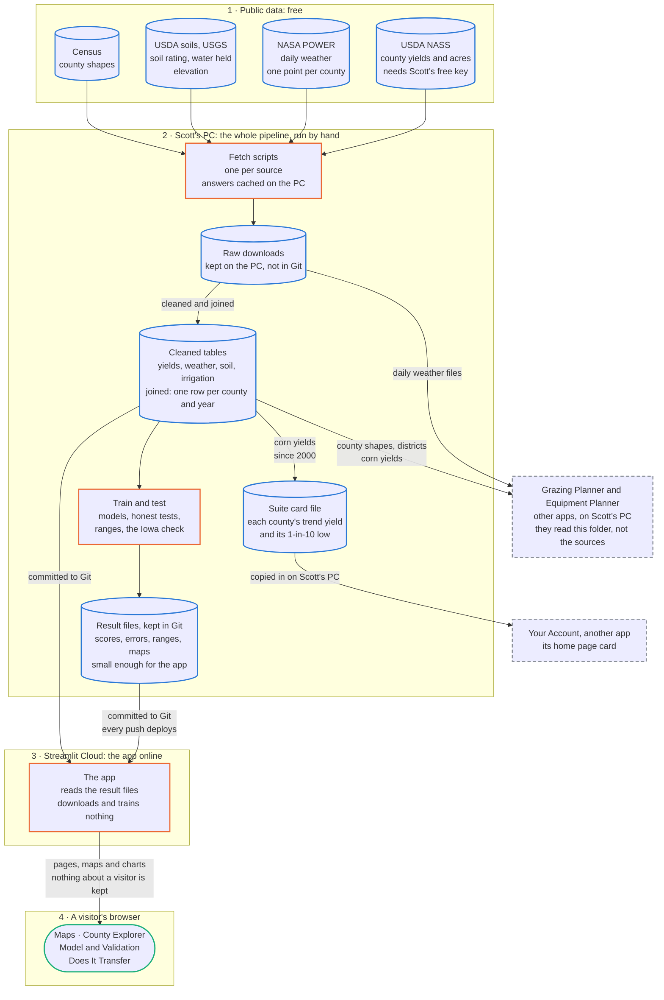

# Where the Yield Predictor's data comes from and where it goes

Everything is downloaded, cleaned, modeled and tested on Scott's PC; the app online only reads the small
result files committed to Git, and it keeps nothing about its visitors.

Checked against the code on 2026-10-02.

## How to read it

- **A cylinder** is data sitting somewhere. **A box** is a step that runs. **A rounded box** is something
  a visitor sees. **A dashed outline** is another Cornerpost app.
- **A numbered frame** is where it happens, in the order the data travels: 1 to 4, top to bottom.
- **An arrow** is data moving; its label says what moves.

## Each arrow, in words

| From | To | What moves | When | Code |
| --- | --- | --- | --- | --- |
| USDA NASS | Fetch scripts | County yields by practice, acres by practice (for the irrigated share) and corn and soybean planted acres (for rotation). Asked for with the NASS key. | When Scott runs them | `scripts/fetch_nass_yields.py`, `fetch_irrigation.py`, `fetch_rotation.py`; `src/yieldpred/nass.py` |
| NASA POWER | Fetch scripts | Daily weather for one point in each county, 2000 on. About 4 minutes the first time. | When Scott runs it | `scripts/fetch_weather.py`; `src/yieldpred/weather.py` |
| USDA soils, USGS | Fetch scripts | Each county's soil rating (NCCPI), the water its soil holds, and its elevation. | Once: they do not change | `scripts/fetch_soil_terrain.py`; `soils.py`, `terrain.py` |
| Census | Fetch scripts | County boundaries and centre points. | Once | `src/yieldpred/geo.py` |
| Fetch scripts | Raw downloads | Every answer as it came, so a step can be redone without asking the source again. | With every fetch | `data/raw/` (not in Git) |
| Raw downloads | Cleaned tables | Yields, growing-season weather features, soil and irrigation, joined into one row per county and year. `--state` and `--crop` pick which table (Nebraska or Iowa, corn or soybeans). | When Scott runs the pipeline | `src/yieldpred/dataset.py`; `data/processed/model_table*.parquet` |
| Cleaned tables | Train and test | The model table. Models are tested on counties and years they never saw, the errors are mapped, a Nebraska model is tried cold on Iowa, and the 80% ranges are checked against how often they held. | When Scott runs the pipeline | `scripts/train_baseline.py`, `analyze_errors.py`, `cross_state.py`, `honest_ranges.py`, `crop_transfer.py` |
| Train and test | Result files | Scores, each county-year's error, the ranges, and the maps. Small files, so they can be kept in Git. | With every run | `data/processed/`, `figures/` |
| Result files, Cleaned tables | The app | The files, as committed. The app wraps them in a cache and draws them. It needs no key. | Every push to GitHub | `src/yieldpred/appdata.py`, `app/` |
| The app | A visitor's browser | Pages, maps and charts. There is no sign-in and no database: a visitor's choices on the page are not stored. | On every visit | `app/streamlit_app.py`, `app/pages/` |
| Cleaned tables | Suite card file | Each county's corn yields since 2000, turned into a trend yield and a 1-in-10 low. | After new yields are fetched | `python scripts/export_suite_card.py` writes `data/processed/suite_card.json` |
| Suite card file | Your Account | The card file, copied into Your Account's own folder and committed there, for its home page. | When Scott runs it | `python -m farm_account.cards refresh`, in farm-account |
| Raw downloads, Cleaned tables | Grazing Planner, Equipment Planner | The daily weather files, county shapes, the crop districts and the county corn yields. Both apps read them from this folder on Scott's PC, which is why the project folders must stay side by side. | When those apps' research or import is run | the Grazing Planner's `forecast_forage.py`; the Equipment Planner's `import_regional_data` |

## What does not move

- **The app never calls a data source.** What it shows is as fresh as the last files Scott committed.
- **Nothing about a visitor is stored.**
- **The NASS key is never in Git.** It is in `.env` on Scott's PC, and the app online needs no key.
- **Raw downloads stay on the PC.** They can be fetched again by the scripts.

## Left off the chart on purpose

- gridMET (a finer weather grid) was fetched to check NASA POWER and is not part of the pipeline.
- How the model, the ranges and the Iowa test work belongs on "how this number was arrived at" charts.
- The weekly security check and the health check belong on the deploy and jobs chart.

## Keeping it current

Change this file in the same delivery as any change that:

- adds or drops a data source;
- adds a file the app reads, or a file another app reads from this folder;
- makes the app store anything about a visitor.

Then update the "Checked against" line at the top.
